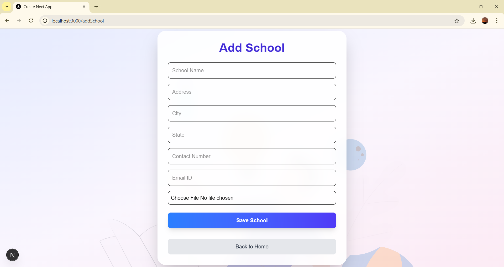
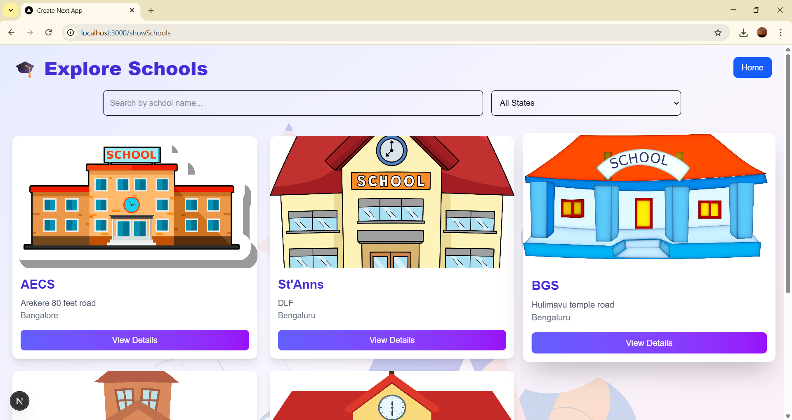
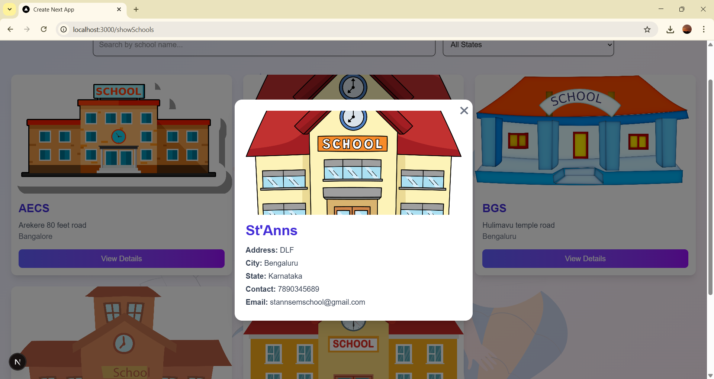
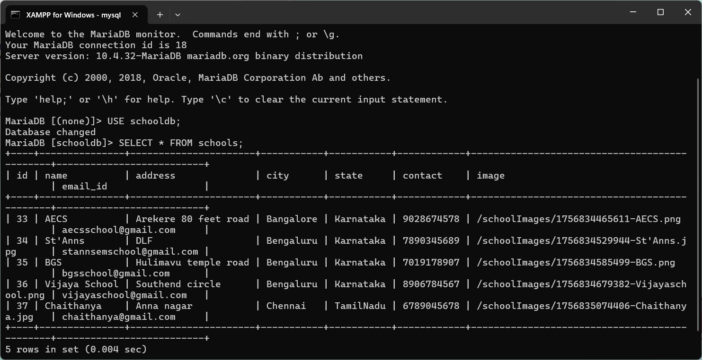
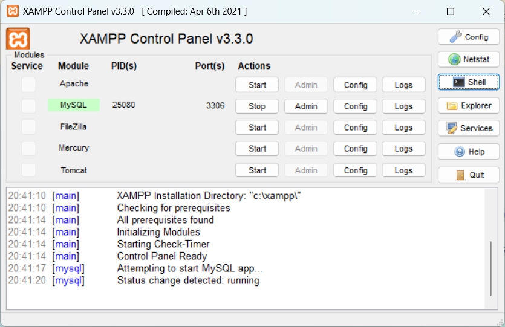

# 🎓 School Management System  

A mini web application built with *Next.js* and *MySQL* that allows users to:  
1. *Add new schools* with details and images.  
2. *View and explore schools* in a modern, responsive UI.  

---

##  Features  

- *Add School Page* (/addSchool)  
  - Form built with react-hook-form + validation.  
  - Uploads school image to public/schoolImages.  
  - Prevents duplicate school entries.  

- *Show Schools Page* (/showSchools)  
  - Displays schools in a grid (like an e-commerce product list).  
  - Includes *search* and *filter by state*.  
  - Modal popup with full school details.  
  - Fully responsive for desktop & mobile.  

- *Home Page* (/)  
  - Navigation to Add School and Show Schools pages.  
  - Animated UI with Lottie and Framer Motion.  

---

## 🛠 Tech Stack  

- *Frontend:* Next.js, React, Tailwind CSS, Framer Motion, Lottie  
- *Backend:* Next.js API Routes, MySQL (mysql2)  
- *Database:* MySQL (schooldb with schools table)  

---

##  Database Setup  

Run the following queries in MySQL:  

```sql
CREATE DATABASE schooldb;

USE schooldb;

CREATE TABLE schools (
  id INT AUTO_INCREMENT PRIMARY KEY,
  name TEXT,
  address TEXT,
  city TEXT,
  state TEXT,
  contact VARCHAR(15),
  email_id VARCHAR(255),
  image TEXT
);
```

---

## Setup Instructions 

git clone https://github.com/your-username/school-management.git
cd school-management

## Install dependencies 
- npm install

## configure database connection in

-/lib/db.js

## Run the development server 
  npm run dev
  open http://localhost:3000 in your browser


  ---

  ## Deployment 

  Github Repo:
  Live Project: 

  #Author 
  Developed by Abinaya S

  ---

##  Screenshots  

###  Home Page  
  

###  Add School Page  
  

###  Show Schools Page  
  

### 📑 School Details Modal  
  

### 🗄 Database (MySQL Command Line)  
  

### ⚙ MySQL Startup  
